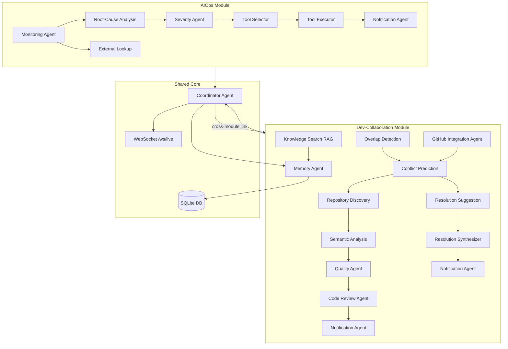

# AI Agent Coordination & Decision Engine

A unified multi-agent system that coordinates two phases of the Software
Development Lifecycle under one Decision Engine:

- **Module 1 — Dev-Collaboration**: predicts and prevents merge conflicts
  between developers *before* they happen (live editing map, conflict-risk
  scoring, AI-suggested resolutions).
- **Module 2 — AIOps Incident Response**: detects production incidents,
  diagnoses root cause, classifies severity, attempts auto-remediation,
  and escalates when needed.
- **Cross-module link**: the Coordinator Agent traces a production incident
  back to a recent risky commit/conflict — proving the two modules work as
  ONE coordinated engine, not two separate tools.

Built for: Infosys Springboard Virtual Internship 7.0 — Batch 1.

**GitHub:** [J-Rakshitha/AI-Agent-Coordination-Decision-Engine](https://github.com/J-Rakshitha/AI-Agent-Coordination-Decision-Engine)

---

## Architecture

```
[Development Phase] ──build──> [Production Phase]
  Dev-Collaboration                 AIOps
  (conflict prevention)             (incident response)
        \                              /
         \                            /
          -----> Coordinator Agent <-----
             (explainable decision log,
              cross-module linking,
              shared memory)
```



**Hybrid AI strategy**: every "thinking" agent calls the Gemini API first.
If the API key is missing, times out, or errors — it automatically falls back
to rule-based logic. The demo NEVER crashes.

---

## Implementation Phases (A–D)

| Phase | Feature | Status |
|-------|---------|--------|
| **A** | Real GitHub Integration — live PR conflict detection | ✅ Complete |
| **B** | Real Server Monitoring — background HTTP probes (own backend + external API) | ✅ Complete |
| **C** | Multi-user Login — JWT auth with demo users | ✅ Complete |
| **D** | MCP Layer — industry-standard tool exposure via Model Context Protocol | ✅ Complete |
| **M3** | Agent Coordination & Memory — specialized agents, shared memory, cross-module linking | ✅ Complete |
| **E1–E5** | Enterprise Intelligence — AST Discovery, Semantic Analysis, Synthesizer, Quality, RAG Search | ✅ Complete |

### Enterprise Intelligence Phases (E1–E5) ✅

Real-time, non-hardcoded enterprise pipeline for Dev-Collaboration conflicts:

| Phase | Agent | What it does |
|-------|-------|--------------|
| **E1** | Repository Discovery Agent | Real AST scan of `backend/app` + `frontend/src` — indexes symbols, complexity, dependencies |
| **E2** | Semantic Analysis Agent | AST diff + Hybrid AI logic-level conflict analysis |
| **E3** | Resolution Synthesizer Agent | Generates 3 merge strategies, scores them, selects best |
| **E4** | Quality Agent | Cyclomatic complexity → structured A/B/C grade scorecard |
| **E5** | Knowledge Search Agent | Gemini embeddings RAG + keyword fallback over knowledge base |

**Conflict detection pipeline:**
```
Discovery → Semantic Analysis → Quality → Code Review → Notify
```

**Resolution pipeline:** Resolution Synthesizer (3 options) + Resolution Suggestion Agent

**New API endpoints:**
- `POST /api/dev-collab/repository/discovery` — Phase E1 AST scan
- `GET /api/system/knowledge-base/search?q=...` — Phase E5 semantic search

**New enterprise tools (8 total):** `semantic_conflict_analyze`, `evaluate_code_quality`, `semantic_knowledge_search` (+ 5 existing M2 tools)

### Milestone 3 — Agent Coordination & Memory Systems (Weeks 5–6) ✅

Milestone 3 delivers a **multi-agent coordination engine** where specialized agents
collaborate through pipelines, shared memory, and a central Coordinator — not isolated
single-purpose scripts.

#### Agent Role Matrix

| Agent | Module | Business Role |
|-------|--------|---------------|
| **Overlap Detection Agent** | Dev-Collab | Finds developers editing the same file/function |
| **Conflict Prediction Agent** | Dev-Collab | Scores merge-conflict risk (0–100%) |
| **Code Review Agent** | Dev-Collab | Flags code-quality/style issues before merge |
| **Resolution Suggestion Agent** | Dev-Collab | Recommends how developers should coordinate |
| **Resolution Synthesizer Agent** | Dev-Collab | Scores 3 merge strategies and selects the best |
| **Repository Discovery Agent** | Dev-Collab | AST repository scan — symbols, complexity, dependencies |
| **Semantic Analysis Agent** | Dev-Collab | Logic-level conflict analysis (AST + Hybrid AI) |
| **Quality Agent** | Dev-Collab | A/B/C code quality scorecard from AST metrics |
| **Knowledge Search Agent** | Both | Semantic RAG search over knowledge base (Gemini embeddings) |
| **GitHub Integration Agent** | Dev-Collab | Syncs live PR conflicts from a real GitHub repo |
| **Code Watch Agent** | Dev-Collab | Tracks live developer edit sessions |
| **Monitoring Agent** | AIOps | Detects metric anomalies (threshold-based) |
| **Root-Cause Analysis Agent** | AIOps | Diagnoses why an incident happened (LLM + memory) |
| **Severity Agent** | AIOps | Classifies P1 / P2 / P3 with SLA deadlines |
| **Tool Selector Agent** | AIOps | Picks the best remediation tool for the situation |
| **Tool Executor Agent** | AIOps | Invokes tools with exception-safe execution |
| **External Lookup Agent** | AIOps | Searches GitHub public issues for known patterns |
| **Notification Agent** | Both | Delivers team alerts (WebSocket + Gmail SMTP + Slack + Discord + Teams) |
| **Coordinator Agent** | Both | Logs all decisions + links Dev conflicts → Production incidents |
| **Memory Agent** | Both | Manages short-term and long-term shared memory |

#### Agent Communication Patterns

```
Orchestrator:  CoordinatorAgent — logs every decision, cross-module linking
Pipeline:      Detect → Code Review → Notify → Resolve → Notify  (Dev-Collab)
               Monitor → Root Cause → Severity → Tool → Link → Notify  (AIOps)
Shared State:  SQLite DB — ConflictEvent, CommitLog, KnowledgeEntry, AgentDecisionLog, TeamNotification
Real-time:     WebSocket /ws/live — live dashboard updates without page refresh
```

#### Memory Architecture

| Type | Storage | Used By | Purpose |
|------|---------|---------|---------|
| **Short-term** | `AgentDecisionLog` table | RootCause, Resolution, ToolSelector agents | Recent situational context within a session |
| **Long-term** | `KnowledgeEntry` table | RootCause, Resolution, CodeReview agents | Persistent patterns — system gets sharper over time |

Agents call `MemoryAgent.recall_knowledge()` **before** falling back to generic rules.
Repeated patterns reinforce entries (`success_count` increments).

#### Milestone 3 API Endpoints

| Method | Path | Purpose |
|--------|------|---------|
| GET | `/api/system/decision-log` | Explainable-AI trail (all agent decisions) |
| GET | `/api/system/knowledge-base` | Long-term memory entries |
| GET | `/api/system/notifications` | Team notification delivery log |

#### Dashboard — UI Panels (All Pages)

| Page | Panel | What it shows |
|------|-------|---------------|
| **Overview** | Stat cards | Active Sessions, Conflicts, Open Incidents, Linked Incidents |
| **Overview** | Shared Knowledge Base | Long-term memory entries with `seen N×` reinforcement |
| **Overview** | Team Notifications | Email/WebSocket alerts from Notification Agent (live refresh) |
| **Overview** | Agent Decision Trail | Every agent decision — LLM vs Rule-based badge |
| **Dev-Collaboration** | Live Editing Map | Real-time developer presence on files/functions |
| **Dev-Collaboration** | Repository Discovery panel | Phase E1 — real AST scan of codebase |
| **Dev-Collaboration** | Predicted Conflicts | Discovery + Semantic + Quality + Code Review + Synthesizer |
| **Dev-Collaboration** | Recent Commits | Auto-created when conflicts resolve — feeds cross-module linking |
| **Dev-Collaboration** | Real GitHub Integration | Live PR sync from configured repo (not simulated) |
| **AIOps** | Live Incident Feed | Severity, root cause, linked commit, **SLA countdown**, escalation status |
| **AIOps** | Tool Integration Panel | Registered tools + measured execution accuracy |
| **All pages** | Header — Live indicator | Green dot = WebSocket connected (real-time) |
| **All pages** | Header — Simulate API Failure | Toggle to prove hybrid LLM fallback live on stage |

**Dev-Collaboration conflict card layout (after detection):**
```
┌─ Predicted Conflict ─────────────────────────────┐
│  Dev A & Dev B  ·  file.py → function  ·  66%   │
│  ┌─ Repository Discovery ────────────────────────┐ │
│  │  AST symbols indexed + target complexity      │ │
│  └───────────────────────────────────────────────┘ │
│  ┌─ Semantic Analysis ───────────────────────────┐ │
│  │  Logic-level risk + conflict type             │ │
│  └───────────────────────────────────────────────┘ │
│  ┌─ Quality Agent — Grade A/B/C ─────────────────┐ │
│  │  Cyclomatic complexity scorecard              │ │
│  └───────────────────────────────────────────────┘ │
│  ┌─ Code Review Agent ───────────────────────────┐ │
│  │  Style/quality advice from hybrid AI          │ │
│  └───────────────────────────────────────────────┘ │
│  [Get AI Suggestion] → Resolution Synthesizer (3 strategies) │
└──────────────────────────────────────────────────┘
→ After resolution: best strategy + RESOLVED badge
```

### 5-Minute Live Demo Script (Milestone 3)

**Recommended for evaluators:** use **GitHub Sync** (real data) instead of Simulate Conflict where possible.

| Step | Page | Action | What to show in UI |
|------|------|--------|---------------------|
| 1 | Overview | Open dashboard | Stat cards + Knowledge Base + **Team Notifications** + Decision Trail |
| 2 | Dev-Collaboration | **Sync with GitHub** (or Simulate Conflict) | Code Review box on conflict card + agents in Decision Trail |
| 3 | Dev-Collaboration | **Get AI Suggestion** | RESOLVED badge + Resolution Suggestion text + Recent Commits entry |
| 4 | AIOps | **Simulate Incident** (or wait 30s for background monitor) | P1/P2 card + Tool accuracy + full agent pipeline in Decision Trail |
| 5 | Overview | Refresh (`Ctrl+Shift+R`) | **Linked Incidents > 0** + Knowledge Base growing + new notifications |
| 6 | Header | Toggle **Simulate API Failure** ON → repeat Step 2 | Rule-based badge in Decision Trail — system never crashes |

**Talking point for evaluators:**
> "A Dev-Collab conflict on `payment_service.py` was later linked to a P1 production
> incident on `checkout-service` — the Coordinator Agent traced it back to the risky merge."

### What's Real vs Demo (Honest Architecture Notes)

| Component | Real / Live | Demo / Simulated |
|-----------|-------------|------------------|
| SQLite database persistence | ✅ Real | |
| WebSocket live updates | ✅ Real-time | |
| GitHub PR conflict sync | ✅ Real API | |
| Background server monitoring | ✅ Real HTTP probes | |
| JWT authentication | ✅ Real | |
| MCP tool layer | ✅ Industry standard | |
| Hybrid LLM (Gemini) | ✅ Real when API key set | Rule-based fallback always available |
| Short/long-term memory | ✅ Real DB-backed | |
| Cross-module incident linking | ✅ Real correlation logic | |
| Code Review Agent output on conflict cards | ✅ Real agent output in UI | |
| Team Notifications panel (Overview) | ✅ Real DB records, live refresh | |
| GitHub webhook (PR events) | ✅ Real-time auto-sync | |
| Slack alerts | ✅ Real when `SLACK_WEBHOOK_URL` set | |
| Discord alerts | ✅ Real when `DISCORD_WEBHOOK_URL` set | |
| Gmail SMTP email alerts | ✅ Real when SMTP + App Password set | |
| Microsoft Teams alerts | ✅ Real when `TEAMS_WEBHOOK_URL` set (M365 account) | |
| SLA countdown (AIOps) | ✅ Live timer on incident cards | |
| Alembic DB migrations | ✅ Schema updates without data loss (001 SLA + 002 enterprise) |
| Enterprise 5-phase pipeline | ✅ Real AST + semantic + quality + RAG (not hardcoded) |
| **Simulate Conflict** button | | ⚠️ Demo trigger (random file/function) |
| **Simulate Incident** button | | ⚠️ Demo trigger (random metrics) |
| Runbook tools (restart/clear cache) | | ⚠️ Simulated actions (safe for demo) |

Demo buttons exist so the presentation never depends on external uptime.
In production, replace them with real metric pipelines and GitHub webhooks.

### Phase A — Real GitHub Integration
- Connects to a real GitHub repo via REST API
- Detects **confirmed** conflicts (`mergeable_state: dirty`) and **predicted** conflicts (2+ PRs touching same file)
- Manual sync: `POST /api/dev-collab/github/sync`
- **Webhook (real-time):** `POST /api/dev-collab/github/webhook` — configure in GitHub repo Settings → Webhooks
- Webhook URL shown on Dev-Collab page and `GET /api/dev-collab/github/status`

### Phase B — Real Server Monitoring
- Background scheduler probes every 30 seconds:
  - **Own backend:** `http://127.0.0.1:8000/api/system/health`
  - **External service:** `https://api.github.com`
- Stores real health snapshots in DB; broadcasts via WebSocket
- Auto-triggers incident pipeline on anomalies
- Endpoints: `GET /api/monitoring/status`, `GET /api/monitoring/history/{service_name}`

### Phase C — Multi-user Login
- JWT-based authentication (register, login, profile)
- Demo users seeded on startup:

| Email | Password | Role |
|-------|----------|------|
| `priya@infosys.com` | `demo123` | developer |
| `arjun@infosys.com` | `demo123` | developer |
| `admin@infosys.com` | `admin123` | admin |

- Endpoints: `POST /api/auth/login`, `GET /api/auth/me`, `GET /api/auth/users`
- UI: optional Sign In modal in header (app works without login too)

### Phase D — MCP Layer
- Exposes all enterprise tools via [Model Context Protocol](https://modelcontextprotocol.io)
- Run: `cd backend && python -m app.mcp_server`
- Tools: `github_issue_lookup`, `restart_service`, `clear_cache`, `check_service_health`, `sync_github_conflicts`, `select_and_execute_tool`, etc.

### Multi-Channel Notifications (Notification Agent)

One simulate action can alert **Slack + Discord + Gmail + live dashboard** in parallel:

| Channel | `.env` variable | Setup |
|---------|-----------------|-------|
| **Slack** | `SLACK_WEBHOOK_URL` | Slack app → Incoming Webhooks |
| **Discord** | `DISCORD_WEBHOOK_URL` | Channel → Integrations → Webhooks |
| **Gmail** | `NOTIFICATION_SMTP_*` + `NOTIFICATION_TEAM_EMAILS` | Google App Password (2-Step ON) |
| **Teams** | `TEAMS_WEBHOOK_URL` | Microsoft 365 / Power Automate (optional) |

Check status: `GET /api/system/integrations`  
Test endpoints: `POST /api/system/test-email`, `POST /api/system/test-discord-webhook`

---

## Tech Stack

| Layer | Tech |
|---|---|
| Backend | Python 3.11+, FastAPI, SQLAlchemy (async), SQLite (dev) |
| Real-time | Native FastAPI WebSockets |
| Auth | JWT (python-jose) + bcrypt |
| Monitoring | Background asyncio scheduler + httpx probes |
| MCP | `mcp` Python SDK (FastMCP) |
| LLM | Google Gemini API via **google-genai** SDK (AIza + AQ keys) + rule-based fallback |
| Frontend | React 18 + Vite, Tailwind CSS, React Router, lucide-react |
| Deployment | Backend → Render, Frontend → Vercel |

---

## Ports

| Port | Service |
|------|---------|
| **8000** | Backend API + WebSocket (`ws://localhost:8000/ws/live`) |
| **5173** | Frontend UI (dashboard) |

---

## Project Structure

```
ai-agent-coordination-engine/
├── backend/
│   ├── app/
│   │   ├── main.py
│   │   ├── mcp_server.py                 # Phase D — MCP tool layer
│   │   ├── core/                           # config, database, security, deps
│   │   ├── models/                         # dev_collab, incident, memory, notification, user
│   │   ├── agents/
│   │   │   ├── coordinator_agent.py        # M3 — orchestrator + cross-module linking
│   │   │   ├── memory_agent.py             # M3 — short/long-term memory
│   │   │   ├── notification_agent.py       # M3 — WebSocket + email alerts
│   │   │   ├── dev_collab/                 # Discovery, Semantic, Quality, Synthesizer, Conflict agents
│   │   │   ├── aiops/                      # Monitoring, Root Cause, Severity, Escalation agents
│   │   │   └── tools/                      # Tool Registry + Selector + Executor (8 tools)
│   │   ├── routers/                        # auth, monitoring, incidents, dev-collab, system
│   │   └── services/                       # code_parser, embedding_service, github_sync_service
│   ├── alembic/versions/                   # 001 SLA + 002 enterprise intelligence
│   ├── tests/
│   │   ├── test_enterprise_phase5.py       # E1–E5 enterprise — 6 tests
│   │   ├── test_milestone3.py              # M3 coordination, memory, notifications
│   │   └── ...                             # 55 tests total
│   ├── run.ps1                             # Windows one-click backend start
│   ├── requirements.txt
├── frontend/
│   ├── src/
│   │   ├── pages/
│   │   │   ├── OverviewPage.jsx            # Stats + Knowledge Base + Notifications
│   │   │   ├── DevCollabPage.jsx           # Conflicts + Code Review + GitHub sync
│   │   │   └── AIOpsPage.jsx               # Incidents + Tool Integration panel
│   │   ├── components/common/
│   │   │   ├── DecisionTrail.jsx           # Explainable-AI agent log
│   │   │   ├── KnowledgeBasePanel.jsx      # Long-term memory visualization
│   │   │   ├── NotificationsPanel.jsx      # Team alerts (WebSocket + email log)
│   │   │   ├── ToolIntegrationPanel.jsx    # Tool registry + accuracy stats
│   │   │   ├── LlmFailureToggle.jsx        # Hybrid AI fallback demo toggle
│   │   │   └── LoginModal.jsx              # Phase C — JWT login
│   │   └── context/                        # AuthContext, LiveSocketContext, ThemeContext
│   ├── run.ps1                             # Windows one-click frontend start
│   └── package.json
└── README.md
```

---

## Setup & Run (Local)

### Quick Start — Windows (2 terminals)

**Terminal 1 — Backend:**
```powershell
cd backend
.\run.ps1
```

**Terminal 2 — Frontend:**
```powershell
cd frontend
.\run.ps1
```

Open **http://localhost:5173** — green **Live** dot in header confirms WebSocket connected.

---

### 1. Backend (Port 8000)

```bash
cd backend
# Create backend/.env manually — see key settings below (not tracked in git)
```

Edit `backend/.env` — key settings:

```env
# LLM — get free key at https://aistudio.google.com/app/apikey
GEMINI_API_KEY=your_actual_key_here
LLM_ENABLED=True

# GitHub — real PR conflict sync (Phase A)
GITHUB_TOKEN=your_github_token_here
GITHUB_REPO_OWNER=your-username
GITHUB_REPO_NAME=your-repo-name
GITHUB_WEBHOOK_SECRET=your_webhook_secret
PUBLIC_BACKEND_URL=http://localhost:8000

# Notifications — Gmail SMTP (Google App Password, not normal password)
NOTIFICATION_EMAIL_ENABLED=True
NOTIFICATION_FROM_EMAIL=your-email@gmail.com
NOTIFICATION_ONCALL_EMAIL=your-email@gmail.com
NOTIFICATION_TEAM_EMAILS=your-email@gmail.com
NOTIFICATION_SMTP_HOST=smtp.gmail.com
NOTIFICATION_SMTP_PORT=587
NOTIFICATION_SMTP_USER=your-email@gmail.com
NOTIFICATION_SMTP_PASSWORD=your-gmail-app-password

# Slack / Discord / Teams — incoming webhook URLs (optional)
SLACK_WEBHOOK_URL=
DISCORD_WEBHOOK_URL=
TEAMS_WEBHOOK_URL=
```

> **Never commit `.env`** — it is gitignored. Copy settings from README env block into `backend/.env` locally.

```bash
pip install -r requirements.txt
python -m uvicorn app.main:app --host 127.0.0.1 --port 8000
```

**Windows (recommended):**
```powershell
cd backend
.\run.ps1
```

Visit **http://localhost:8000/docs** for interactive API docs.

### 2. Frontend (Port 5173)

```bash
cd frontend
npm install
npm run dev
```

**Windows:**
```powershell
cd frontend
.\run.ps1
```

Visit **http://localhost:5173**.

### 3. MCP Server (Phase D — optional)

```bash
cd backend
python -m app.mcp_server
```

### Running Tests

```bash
# From project root (recommended — uses root pytest.ini)
python -m pytest -v

# Or from backend directory
cd backend
python -m pytest -v                  # Full suite — 55 tests
python -m pytest tests/test_enterprise_phase5.py -v   # Enterprise E1–E5 — 6 tests
python -m pytest tests/test_milestone3.py -v   # Milestone 3 only — 6 tests
python -m pytest tests/test_enterprise_integrations.py -v   # SLA, webhook, Slack, Discord, Gmail — 14 tests
python -m pytest tests/test_llm_hybrid.py -v   # Hybrid LLM (google-genai SDK) — 3 tests
```

All tests use an isolated `test_coordination_engine.db` (separate from your
real dev database) and reset schema before every test, so they never
interfere with data you're using for a live demo.

### Database Migrations (Alembic)

Schema changes are applied automatically on backend startup via Alembic.
You can also run migrations manually:

```bash
cd backend
alembic upgrade head
```

This adds new columns (e.g. SLA fields) **without deleting** existing data.
Legacy manual step (only if migrations fail):

```powershell
cd backend
del coordination_engine.db
.\run.ps1
```

The backend recreates all tables automatically on startup.

### Verify Everything Works

| Check | URL / Action | Expected |
|-------|-------------|----------|
| Backend health | http://localhost:8000/api/system/health | `{"status":"ok"}` |
| API docs | http://localhost:8000/docs | Swagger UI loads |
| Dashboard | http://localhost:5173 | UI loads, green Live dot |
| Notifications API | http://localhost:8000/api/system/notifications | JSON array |
| Full test suite | `python -m pytest -v` (project root or backend) | **55 passed** |

---

## API Endpoints

### System
| Method | Path | Purpose |
|--------|------|---------|
| GET | `/api/system/health` | Health check (also monitored by Phase B) |
| GET | `/api/system/stats` | Dashboard stat cards |
| GET | `/api/system/decision-log` | Explainable-AI trail |
| GET | `/api/system/knowledge-base` | Long-term agent memory |
| GET | `/api/system/notifications` | Team notification delivery log |
| POST | `/api/system/toggle-llm-failure` | Force rule-based fallback |

### Phase A — GitHub
| Method | Path | Purpose |
|--------|------|---------|
| GET | `/api/dev-collab/github/status` | GitHub connection status |
| POST | `/api/dev-collab/github/sync` | Sync live PR conflicts from real repo |

### Phase B — Monitoring
| Method | Path | Purpose |
|--------|------|---------|
| GET | `/api/monitoring/status` | Latest health snapshot per service |
| GET | `/api/monitoring/history/{service_name}` | Probe history |

### Phase C — Auth
| Method | Path | Purpose |
|--------|------|---------|
| POST | `/api/auth/login` | Login → JWT token |
| POST | `/api/auth/register` | Register new user |
| GET | `/api/auth/me` | Current user profile |
| GET | `/api/auth/users` | List demo users |

### Dev-Collaboration
| Method | Path | Purpose |
|--------|------|---------|
| POST | `/api/dev-collab/edit-session/start` | Register a developer editing a file/function |
| GET | `/api/dev-collab/active-sessions` | List live edit sessions |
| POST | `/api/dev-collab/check-conflicts` | Run overlap + conflict-risk detection |
| POST | `/api/dev-collab/simulate-demo-conflict` | One-click demo conflict scenario |
| POST | `/api/dev-collab/repository/discovery` | Phase E1 — AST repository discovery |
| GET | `/api/dev-collab/conflicts` | List conflicts (discovery, semantic, quality JSON fields) |
| POST | `/api/dev-collab/conflicts/{id}/suggest-resolution` | Hybrid-AI resolution suggestion |
| GET | `/api/dev-collab/commits` | Commit history (used for cross-module linking) |

### AIOps & Tools
| Method | Path | Purpose |
|--------|------|---------|
| POST | `/api/incidents/ingest-metrics` | Feed metrics through agent pipeline |
| POST | `/api/incidents/simulate` | Demo one-click incident |
| GET | `/api/incidents/` | List incidents |
| GET | `/api/tools/` | List registered enterprise tools |
| POST | `/api/tools/select-and-execute` | Intelligent tool selection |
| GET | `/api/tools/accuracy` | Tool execution accuracy stats |
| WS | `/ws/live` | Real-time event stream |

---

## Alignment with Infosys Springboard Project Brief

| Required Outcome | Where it's implemented |
|---|---|
| Multi-Agent Coordination Framework | Coordinator Agent + **20 specialized agents** |
| Intelligent Decision Support | Severity, Root-Cause, Code Review, Conflict-Risk, Tool Selector agents |
| Tool & System Integration | External Lookup Agent, Tool Registry, MCP Layer (Phase D) |
| Shared Knowledge & Memory Management | MemoryAgent — short-term (`AgentDecisionLog`) + long-term (`KnowledgeEntry`) |
| Workflow Automation Platform | Dev-Collab + AIOps end-to-end pipelines with Notification Agent |
| Enterprise API Layer | FastAPI REST + WebSocket + MCP |
| Agent Communication | Orchestrator + Pipeline + Shared DB blackboard (Milestone 3) |
| Real-time Dashboard UI | WebSocket live updates + Notifications + Code Review panels |
| Real-time Monitoring (Phase B) | Background scheduler + Server Monitor Agent |
| Multi-user Access (Phase C) | JWT auth with role-based demo users |
| LangChain configured | HybridAIClient via **google-genai** SDK (AIza + AQ auth keys) |
| Custom enterprise tools & API connectors | `tool_registry.py` — **8 registered tools** |
| Intelligent tool selection | `ToolSelectorAgent` — LLM + keyword fallback + short-term memory |
| Testing | **55 pytest tests** — `python -m pytest -v` |

---

## Push to GitHub (one shot)

From the project root (never commits `.env` — it is gitignored):

```powershell
git add -A; git commit -m "Enterprise 5-phase intelligence: Discovery, Semantic, Synthesizer, Quality, RAG — 55 tests"; git push origin main
```

Repo: [J-Rakshitha/AI-Agent-Coordination-Decision-Engine](https://github.com/J-Rakshitha/AI-Agent-Coordination-Decision-Engine)

---

## Build Plan

- [x] Phase 1 — Project Setup
- [x] **Phase A — Real GitHub Integration**
- [x] **Phase B — Real Server Monitoring (background probes)**
- [x] **Phase C — Multi-user Login (JWT)**
- [x] **Phase D — MCP Tool Layer**
- [x] Tool Integration (Milestone 2) — 5 enterprise tools + intelligent selection
- [x] **Milestone 3 — Agent Coordination & Memory Systems**
- [x] Milestone 3 UI — Code Review on conflict cards + Team Notifications panel
- [x] Enterprise polish — Alembic migrations, SLA countdown UI, GitHub webhook, Slack/Discord/Gmail alerts
- [x] **Enterprise E1–E5** — Repository Discovery, Semantic Analysis, Synthesizer, Quality, RAG Search
- [x] **55 automated tests** — full suite green from project root
- [x] Milestone documents updated (Sprint 3: 27-Jul to 04-Aug-2026)
- [x] GitHub push — [repo live](https://github.com/J-Rakshitha/AI-Agent-Coordination-Decision-Engine)
- [ ] Render/Vercel deployment
- [ ] Final demo rehearsal

---

## License

Built for educational/internship purposes (Infosys Springboard Virtual Internship 7.0).
